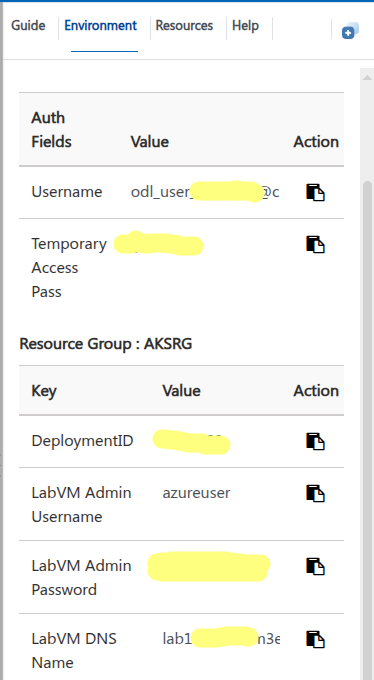

# Inspektor Gadget Contribfest: Enhancing the Observability and Security of Your K8s Clusters Through an easy to use Framework

Welcome to our contribfest. Please follow this guide to get access to the dev
environment and the different exercises we have prepared for you.

## Prerequisites

We provide a cloud environment with everything installed. However, you can run
it on your local machine by installing the following tools:
- ssh client (to access the dev VM)
- [az CLI](https://learn.microsoft.com/cli/azure/install-azure-cli)
- [kubectl](https://kubernetes.io/docs/tasks/tools/#kubectl)
- [kubectl
  gadget](https://inspektor-gadget.io/docs/latest/quick-start/#long-running-deployment-on-all-worker-nodes)

## Dev environment

In order to facilitate the exercises, we provide a cloud environment composed
by:
- A Kubernetes cluster deployed in Azure Kubernetes Service (AKS) with
  Prometheus and Grafana installed
- A development VM with all the needed tools installed and configured to
  interact with the cluster and to create new gadgets

### Activating the Dev Environment

> [!WARNING]
> It seems to be some issues with Firefox, so please use Chrome or Edge to access
> the lab.

Go to https://experience.cloudlabs.ai/#/odl/b5f301cd-bacb-45d0-b642-2be884f221b6
to activate your dev environment, use the activation code provided during the
presentation, fill your information data and click on "Submit"

<p align="center">
  
</p>

On the next screen, click on "Launch Lab", then wait until it's ready.

<p align="center">
  
</p>

One the lab is ready, it'll log you in the development VM. You can use it
directly from the browser. This machine is already configured to access the
Kubernetes cluster:

```bash
$ kubectl get nodes
NAME                                STATUS   ROLES    AGE   VERSION
aks-nodepool1-25038520-vmss000000   Ready    <none>   92m   v1.32.7
aks-nodepool1-25038520-vmss000001   Ready    <none>   92m   v1.32.7
```

### Using your own machine

If you prefer to use your own machine to access the dev VM and/or the Kubernetes
cluster.

#### Dev VM access

You can use SSH. Click on the "Environment" tab and look for the data to access
the dev VM:
- LabVM Admin Username
- LabVM Admin Password
- LabVM DNS Name

<p align="center">
  
</p>

```bash
$ ssh azureuser@lab195___.eastus.cloudapp.azure.com
azureuser@lab195___:~$
```

#### Kubernetes Cluster

You need to install the [Azure
CLI](https://learn.microsoft.com/cli/azure/install-azure-cli) and login using
the Azure credentials on the Environment tab:

<p align="center">
  
</p>

```bash
az login
```

Then, get the credentials for the cluster:

```bash
az aks get-credentials --resource-group AKSRG --name aks-kubeconna2025
```

```bash
$ kubectl get nodes
NAME                                STATUS   ROLES    AGE   VERSION
aks-nodepool1-30504426-vmss000000   Ready    <none>   27m   v1.32.7
aks-nodepool1-30504426-vmss000001   Ready    <none>   27m   v1.32.7
```

## Deploying Inspektor Gadget

Now that you have access to the cluster, it's time to deploy Inspektor Gadget.

> [!WARNING]
> If you're using your local machine, make sure you have
> [kubectl-gadget](https://inspektor-gadget.io/docs/latest/quick-start/#long-running-deployment-on-all-worker-nodes)
> installed.

To deploy Inspektor Gadget, run the following command:

```bash
wget https://raw.githubusercontent.com/inspektor-gadget/Contribfest-KubeCon-NA2025/refs/heads/main/labs/daemon-config.yaml
kubectl gadget deploy --daemon-config daemon-config.yaml
```

### Running your first Gadget

Now that you have Inspektor Gadget deployed, let's run your first gadget. Let's monitor processes executions by using the trace_exec gadget:

```bash
kubectl gadget run trace_exec
```

In another terminal, create a pod that will generate some process executions:

```bash
$ kubectl run --restart=Never --image=busybox myapp1-pod --labels="name=myapp1-pod,myapp=app-one,role=demo" -- sh -c 'while /bin/true ; do date ; cat /proc/version ; /bin/sleep 1 ; done'
pod/myapp1-pod created
```

You should see the process executions in the first terminal:

```bash
K8S.NODE            K8S.NAMESPACE               K8S.PODNAME                 K8S.CONTAINERNAME           COMM                        PID            TID PCOMM                    PPID ARGS           ERR… USER           LOGINUSER      GROUP
aks-nodepool1-3050  default                     myapp1-pod                  myapp1-pod                  true                    2957112        2957112 sh                    2589510 /bin/true           root           uid:4294967295 root
aks-nodepool1-3050  default                     myapp1-pod                  myapp1-pod                  date                    2957113        2957113 sh                    2589510 /bin/date           root           uid:4294967295 root
```

Now that you have run your first gadget, it's time to explore more advanced use cases.

## Exercises

- [Troubleshoot your cluster with Gadgets](./labs/01-troubleshooting/README.md)
- [Export metrics to Prometheus / Grafana](./labs/02-monitoring/README.md)
- [Create your own Gadget](./labs/03-creating-your-own-gadget/README.md)
- [Contribute to Inspektor Gadget](./labs/04-contributing/README.md)

## Thanks

Thanks for the whole Inspektor Gadget team for the work on the project, and
specially to [@burak-ok](https://github.com/burak-ok/),
[@mqasimsarfraz](https://github.com/mqasimsarfraz/) and
[@flyth](https://github.com/flyth/) who prepared a contribfest early this year
that served as base for this one:
https://github.com/inspektor-gadget/Contribfest-KubeCon-Europe2025
